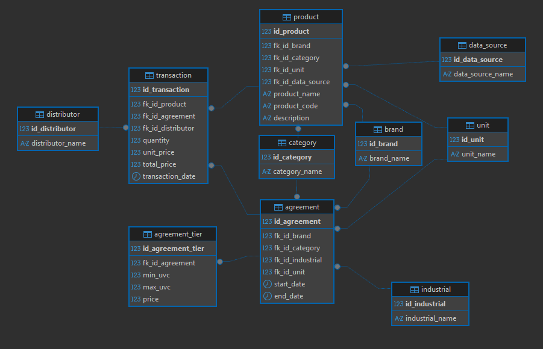

# Data Model — `rev_acc_database`

## Vue d'ensemble

Ce modèle de données gère les **accords de reversement** négociés entre industriels et **Entegra**, par marque et catégorie, avec un système de paliers basés sur les volumes UVC (Unités de Vente Consommateur).

### Chaîne commerciale

```
Industriel → (accord de reversement) → Entegra → (négociation) → Distributeur → (vente) → Client final
```

### Schéma des relations

```
brand ──────────────────────────────┬──▶ product
unit ───────────────────────────────┤
data_source ────────────────────────┤
category ───────────────────────────┘

brand ──────────────────────────────┬──▶ agreement ──▶ agreement_tier
category ───────────────────────────┤
unit ───────────────────────────────┤
industrial ─────────────────────────┘

product ─────────────────────────────┬──▶ transaction
agreement ───────────────────────────┤
distributor ─────────────────────────┘
```

---

## Conventions

| Élément | Convention |
|---|---|
| Clés primaires | `id_<table>` |
| Clés étrangères | `fk_id_<table_cible>` |
| Suppressions | `ON DELETE CASCADE` sur toutes les FK |
| Encodage | `utf8mb4` / `utf8mb4_general_ci` |
| Moteur | `InnoDB` (support des FK et transactions ACID) |

---

## Tables

### `brand`
Référentiel des marques (ex : Amora, Knorr, Tabasco).

| Colonne | Type | Contrainte | Description |
|---|---|---|---|
| `id_brand` | INT | PK, AUTO_INCREMENT | Identifiant unique |
| `brand_name` | VARCHAR(255) | NOT NULL | Nom de la marque |

---

### `category`
Référentiel des catégories produit (ex : Sauces Salades 5L, Tabasco Mini).

| Colonne | Type | Contrainte | Description |
|---|---|---|---|
| `id_category` | INT | PK, AUTO_INCREMENT | Identifiant unique |
| `category_name` | VARCHAR(255) | NOT NULL | Nom de la catégorie |

---

### `data_source`
Référentiel des sources de données (ex : Déclaratif Distributeur Cadhi, Déclaratif Distributeur Entegra Ami2).

| Colonne | Type | Contrainte | Description |
|---|---|---|---|
| `id_data_source` | INT | PK, AUTO_INCREMENT | Identifiant unique |
| `data_source_name` | VARCHAR(255) | NOT NULL | Nom de la source de données |

---

### `distributor`
Référentiel des distributeurs (ex : Back Europe, France Frais, Pomona Episaveurs). Les distributeurs sont les clients d'Entegra — ils n'interviennent pas dans la négociation des accords, uniquement dans les transactions.

| Colonne | Type | Contrainte | Description |
|---|---|---|---|
| `id_distributor` | INT | PK, AUTO_INCREMENT | Identifiant unique |
| `distributor_name` | VARCHAR(255) | NOT NULL | Nom du distributeur |

---

### `industrial`
Référentiel des industriels / fournisseurs (ex : Unilever FoodSolutions).

| Colonne | Type | Contrainte | Description |
|---|---|---|---|
| `id_industrial` | INT | PK, AUTO_INCREMENT | Identifiant unique |
| `industrial_name` | VARCHAR(255) | NOT NULL | Nom de l'industriel |

---

### `unit`
Référentiel des unités de vente (ex : Kg, Seau, Bouteille).

| Colonne | Type | Contrainte | Description |
|---|---|---|---|
| `id_unit` | INT | PK, AUTO_INCREMENT | Identifiant unique |
| `unit_name` | VARCHAR(255) | NOT NULL | Nom de l'unité |

---

### `product`
Produits commercialisés, rattachés à une marque, une catégorie et une source de données.

> **Choix de conception** : `product` n'est pas lié à un distributeur ou un industriel spécifique. Un même produit peut être vendu dans le cadre de plusieurs accords différents. Ces liens sont portés par `transaction` et `agreement`. La colonne `fk_id_data_source` trace l'origine du référentiel produit (système déclaratif source).

| Colonne | Type | Contrainte | Description |
|---|---|---|---|
| `id_product` | INT | PK, AUTO_INCREMENT | Identifiant unique |
| `fk_id_brand` | INT | FK → `brand`, NOT NULL | Marque du produit |
| `fk_id_category` | INT | FK → `category`, NOT NULL | Catégorie du produit |
| `fk_id_unit` | INT | FK → `unit`, NOT NULL | Unité de vente |
| `fk_id_data_source` | INT | FK → `data_source`, NOT NULL | Source du référentiel produit |
| `product_name` | VARCHAR(255) | NULL | Nom du produit (peut être absent si non mappé) |
| `product_code` | VARCHAR(255) | NULL | Code du produit |
| `description` | TEXT | NULL | Description libre |

---

### `agreement`
Accord de reversement entre un industriel et **Entegra**, pour une marque et une catégorie données sur une période définie.

> **Choix de conception** : Entegra étant toujours le signataire côté acheteur, elle n'est pas stockée comme FK — ce serait une valeur constante sans intérêt analytique. Un accord est la table de jonction implicite entre `brand`, `category` et `industrial`.

| Colonne | Type | Contrainte | Description |
|---|---|---|---|
| `id_agreement` | INT | PK, AUTO_INCREMENT | Identifiant unique |
| `fk_id_brand` | INT | FK → `brand`, NOT NULL | Marque concernée |
| `fk_id_category` | INT | FK → `category`, NOT NULL | Catégorie concernée |
| `fk_id_industrial` | INT | FK → `industrial`, NOT NULL | Industriel signataire |
| `fk_id_unit` | INT | FK → `unit`, NOT NULL | Unité de vente pour les paliers |
| `start_date` | DATE | NULL | Date de début de l'accord |
| `end_date` | DATE | NULL | Date de fin de l'accord |

---

### `agreement_tier`
Paliers de reversement d'un accord. Chaque ligne définit une tranche de volume UVC et le prix de reversement associé.

> **Choix de conception** : Les paliers sont dans une table dédiée plutôt qu'en colonnes fixes (`min_price`, `mid_price`, `max_price`) afin de supporter un nombre variable de paliers par accord. Le dernier palier d'un accord a `max_uvc = NULL` (pas de plafond).

**Exemple** pour un accord Amora / Sauces Salades 5L :

| `min_uvc` | `max_uvc` | `price` |
|---|---|---|
| 25 000 | 35 000 | 1,20 € |
| 35 000 | 40 000 | 1,30 € |
| 40 000 | NULL | 1,50 € |

| Colonne | Type | Contrainte | Description |
|---|---|---|---|
| `id_agreement_tier` | INT | PK, AUTO_INCREMENT | Identifiant unique |
| `fk_id_agreement` | INT | FK → `agreement`, NOT NULL | Accord parent |
| `min_uvc` | INT | NOT NULL | Borne inférieure du palier (incluse) |
| `max_uvc` | INT | NULL | Borne supérieure du palier (NULL = pas de plafond) |
| `price` | FLOAT | NOT NULL | Prix de reversement pour ce palier (€) |

---

### `transaction`
Vente effective d'un produit, dans le cadre d'un accord commercial.

> **Choix de conception** :
> - `fk_id_agreement` permet de remonter à l'accord, puis aux paliers (`agreement_tier`), pour calculer le reversement applicable au moment de la vente.
> - `fk_id_distributor` identifie quel distributeur (client d'Entegra) a passé la commande.
> - `total_price` est un snapshot historique (`quantity × unit_price`). Il ne doit pas être recalculé dynamiquement : il capture le prix au moment exact de la transaction.

| Colonne | Type | Contrainte | Description |
|---|---|---|---|
| `id_transaction` | INT | PK, AUTO_INCREMENT | Identifiant unique |
| `fk_id_product` | INT | FK → `product`, NOT NULL | Produit vendu |
| `fk_id_agreement` | INT | FK → `agreement`, NOT NULL | Accord applicable |
| `fk_id_distributor` | INT | FK → `distributor`, NOT NULL | Distributeur acheteur |
| `quantity` | INT | NOT NULL | Quantité vendue (UVC) |
| `unit_price` | DECIMAL(10,2) | NOT NULL | Prix unitaire au moment de la vente (€) |
| `total_price` | DECIMAL(10,2) | NOT NULL | Montant total = quantity × unit_price (snapshot) |
| `transaction_date` | DATE | NOT NULL | Date de la transaction |

---

## Screenshot du Modèle Physique des Données dans DBeaver


